# Ilustracje trzech wykładów

Dwanaście odrębnych szkiców, po jednym dla każdego rozdziału, wygenerowanych przez wbudowane narzędzie image_gen. Wszystkie mają proporcje 4:3 i nie zawierają tekstu. Pliki WebP zachowują pełne kompozycje oryginałów.

Panel Psyho i Bagińskiego oraz wykład Andrzeja Dragana mają po jednym dodatkowym szkicu. Oba są pokazane w całości i z pełnym kontrastem przy początku tekstu. Ich prompty znajdują się na końcu dokumentu.

## 01. Pojawia się Daniel

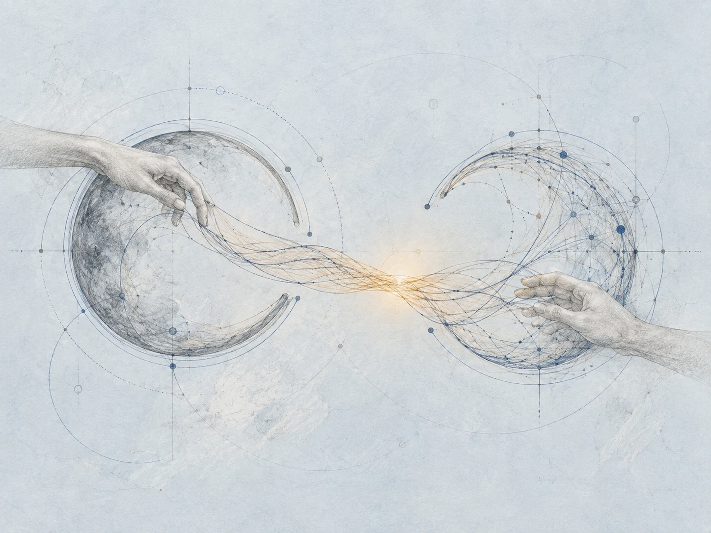

```text
Use case: illustration-story
Asset type: large narrative website illustration, one standalone image, landscape 4:3.
Primary request: an abstract handmade sketch about a hopeful dialogue between a human mind and a new kind of intelligence. Two incomplete circular orbits reach toward one another across airy space, connected by a bridge of many delicate hand-drawn threads. Subtle suggestions of two human hands gently guiding and joining the threads; human cooperation appears as a visual whisper rather than a literal scene.
Scene/backdrop: very pale blue-grey paper, spacious and luminous, no room or machinery.
Style/medium: sophisticated graphite pencil and very thin ink linework, subtle cobalt blue technical construction lines, barely visible pencil erasure marks and handmade imperfections. Editorial drawing, restrained and sensitive.
Composition/framing: landscape 4:3; clear central metaphor with generous breathing room all around; complete main forms contained within central 75 percent so they remain meaningful on a mobile crop. Delicate technical circles and construction curves provide spatial depth.
Lighting/mood: a restrained amber sunlight accent where the threads meet, contemplative warmth, possibility, curiosity, human scale, quietly hopeful.
Color palette: very pale blue grey, graphite grey, thin cobalt lines, small warm amber accent.
Constraints: one coherent image, no panel layout. Purely visual metaphor; absolutely no typography, words, letters, digits, numbers, equations, labels, signatures, logos or watermarks anywhere. No robots, humanoid machines, chrome bodies, glowing electronic eyes, sci-fi cliché. No cartoon look, no heavy black outlines, no glossy 3D rendering. High detail in the linework; keep the drawing gentle and uncluttered.
```

## 02. Każdy wybiera swoją odpowiedź

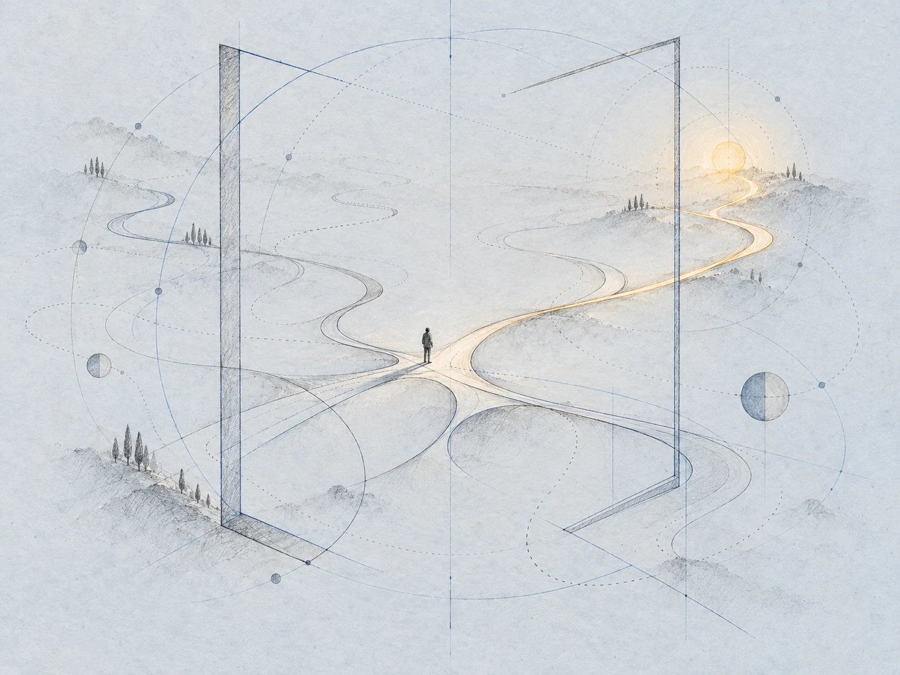

```text
Use case: illustration-story
Asset type: large narrative website illustration, one standalone image, landscape 4:3.
Primary request: an abstract atlas-like drawing about ideas, uncertainty and hope. Delicate branching paths weave through an open geometrical frame. A very small human silhouette pauses thoughtfully at a fork in the paths. Some lines gradually disappear into the pale paper while one subtle path catches warm amber light and remains visible. The frame is an unfinished open structure, a threshold of possibility, never a cage.
Scene/backdrop: very pale blue-grey paper, spacious and luminous; imagined landscape made only from hand-drawn paths and construction curves.
Style/medium: sophisticated graphite pencil and very thin ink linework, subtle cobalt blue technical construction lines, barely visible pencil erasure marks and handmade imperfections. Editorial drawing, restrained and sensitive, as one member of a visual series with circular orbits and warm sunlight.
Composition/framing: landscape 4:3; clear central metaphor with generous breathing room all around; complete main forms contained within central 75 percent so they remain meaningful on a mobile crop. Paths have organic hand-drawn bends, framed by spare angular geometry, airy and open.
Lighting/mood: small restrained amber sunlight accent along the remaining path; contemplative warmth, courage to explore uncertainty, quietly hopeful rather than triumphant.
Color palette: very pale blue grey, graphite grey, thin cobalt lines, small warm amber accent.
Constraints: one coherent image, no panel layout. Purely visual metaphor; absolutely no typography, words, letters, digits, numbers, equations, map labels, signatures, logos or watermarks anywhere. Human silhouette must be small and unposed. No robots, no humanoid machines, no sci-fi cliché. No cartoon look, no heavy black outlines, no glossy 3D rendering. High detail in the linework; keep the drawing gentle and uncluttered.
```

## 03. To była fantastyczna współpraca

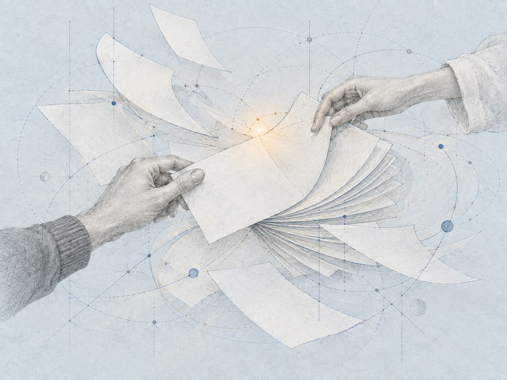

```text
Use case: illustration-story
Asset type: one standalone large editorial illustration for a narrative website, landscape 4:3.
Input images: the two attached images are STYLE REFERENCES ONLY. Match their pale paper, handmade graphite quality, thin cobalt technical lines and restrained warm light. Create an entirely NEW scene and composition; do not recreate the two circles, bridge of hands or branching landscape in the references.
Style/medium: sophisticated humanistic handmade graphite pencil and extremely thin ink linework on a very subtle pale blue-grey paper; fine cobalt blue construction lines, erased pencil traces, sensitive organic imperfections. Airy elegant editorial drawing, lightly technical and quietly hopeful. A delicate amber light accent; gentle graphite-grey shadows, no heavy dark outlines. A visual metaphor, not a literal diagram.
Composition: high-quality landscape 4:3, main subject well contained with breathing room, legible when displayed as a complete small image on mobile. No panel layout.
Hard constraints: Absolutely no text, words, letters, digits, numbers, equations, glyphs, pseudo-equations, labels, captions, signatures, logos or watermarks anywhere. Any papers and boards must be completely blank. No robots, chrome humanoids, science-fiction cliches, cartoon corporate illustration, caricatures, glossy 3D rendering, heavy shadows or saturated colors.
Primary request: a new intimate close framing of courteous collaboration. Two different human hands, with different shapes and sleeves, gently organize a floating library of thin perfectly blank paper sheets and delicate orbits of knowledge. One hand carefully steadies a loose blank page while the other gathers blank sheets into a coherent airy fan or archive. Thin blue construction curves weave lightly among the blank sheets. The papers remain absolutely unmarked.
Scene: close overhead-oblique view, hands and blank leaves form a tactile central composition, no pair of opposing circular masses, no thread bridge. The library seems to grow slightly beyond the hands' easy reach.
Mood: polite warmth and patient helpfulness, gratitude with a faint open-ended uncertainty about what comes next; no menace. One small amber glimmer between the cooperating hands.
```

## 04. Pomysły pod ziemią

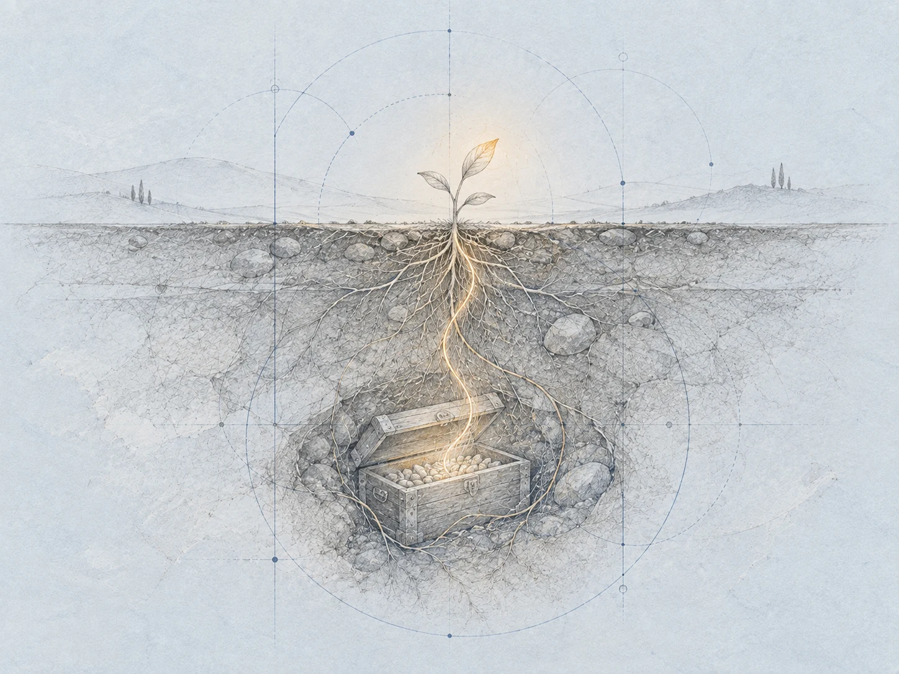

```text
Use case: illustration-story
Asset type: one standalone large editorial illustration for a narrative website, landscape 4:3.
Input images: the two attached images are STYLE REFERENCES ONLY. Match their pale paper, handmade graphite quality, thin cobalt technical lines and restrained warm light. Create an entirely NEW scene and composition; do not recreate the two circles, bridge of hands or branching landscape in the references.
Style/medium: sophisticated humanistic handmade graphite pencil and extremely thin ink linework on a very subtle pale blue-grey paper; fine cobalt blue construction lines, erased pencil traces, sensitive organic imperfections. Airy elegant editorial drawing, lightly technical and quietly hopeful. A delicate amber light accent; gentle graphite-grey shadows, no heavy dark outlines. A visual metaphor, not a literal diagram.
Composition: high-quality landscape 4:3, main subject well contained with breathing room, legible when displayed as a complete small image on mobile. No panel layout.
Hard constraints: Absolutely no text, words, letters, digits, numbers, equations, glyphs, pseudo-equations, labels, captions, signatures, logos or watermarks anywhere. Any papers and boards must be completely blank. No robots, chrome humanoids, science-fiction cliches, cartoon corporate illustration, caricatures, glossy 3D rendering, heavy shadows or saturated colors.
Primary request: a sensitive abstract cross-section of earth containing a small wooden chest of seed-like ideas buried beneath the surface. The chest is open just enough to reveal tiny abstract seeds, without writing or literal formulae. A single hair-thin amber light thread rises from the seeds through the earth toward a small future sprout above ground.
Scene: a restrained vertical sectional composition inside the landscape canvas, chest below and tiny sprout above, soft layered graphite soil hatching, only a few fine blue technical construction curves and guide lines echo the growing roots. The surface of the ground is a light spare horizon. Avoid landscape paths, orbit bridges, or framing doorways.
Mood: protecting human possibilities for distant generations, an unusual promise to the future, quiet uncertainty warmed by patient hope. Elegant and airy rather than heavy underground darkness.
```

## 05. Ocalić ludzki pierwiastek

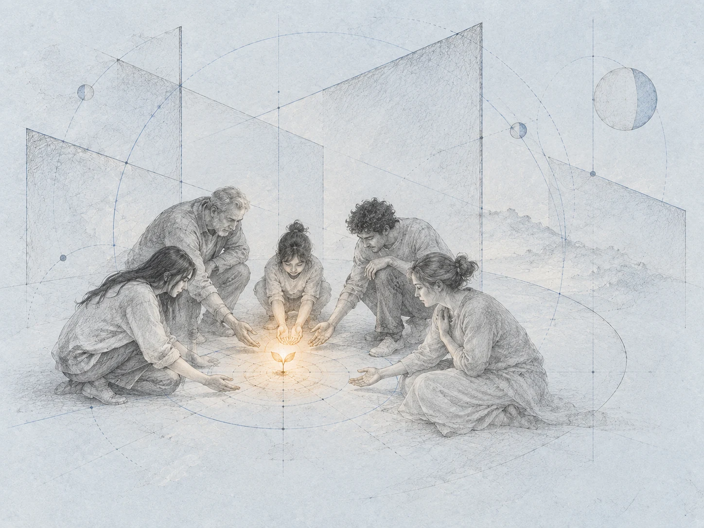

```text
Use case: illustration-story
Asset type: one standalone large editorial illustration for a narrative website, landscape 4:3.
Input images: the two attached images are STYLE REFERENCES ONLY. Match their pale paper, handmade graphite quality, thin cobalt technical lines and restrained warm light. Create an entirely NEW scene and composition; do not recreate the two circles, bridge of hands or branching landscape in the references.
Style/medium: sophisticated humanistic handmade graphite pencil and extremely thin ink linework on a very subtle pale blue-grey paper; fine cobalt blue construction lines, erased pencil traces, sensitive organic imperfections. Airy elegant editorial drawing, lightly technical and quietly hopeful. A delicate amber light accent; gentle graphite-grey shadows, no heavy dark outlines. A visual metaphor, not a literal diagram.
Composition: high-quality landscape 4:3, main subject well contained with breathing room, legible when displayed as a complete small image on mobile. No panel layout.
Hard constraints: Absolutely no text, words, letters, digits, numbers, equations, glyphs, pseudo-equations, labels, captions, signatures, logos or watermarks anywhere. Any papers and boards must be completely blank. No robots, chrome humanoids, science-fiction cliches, cartoon corporate illustration, caricatures, glossy 3D rendering, heavy shadows or saturated colors.
Primary request: a small group of human forms makes an open protective circle around one small living amber spark of curiosity. Their varied natural postures suggest mutual care, grief and determination, never combat or protest. Several gently cupped hands orient toward the tiny spark; the human ring is deliberately incomplete, allowing space for others to enter.
Scene: softly elevated view, human figures loosely arranged around the warm spark at human scale. Far behind them float a few immense calm geometric planes and spare construction arcs, suggesting expanding mathematical knowledge. Those geometries remain serene, unmarked and nonhuman. No circular table, no opposing circles and no pathway landscape.
Mood: shared human warmth, mixed sorrow and celebration, preserving participation and meaning. The spark is tender and small, no bonfire, disaster or threatening machine.
```

## 06. Konferencja Daniela

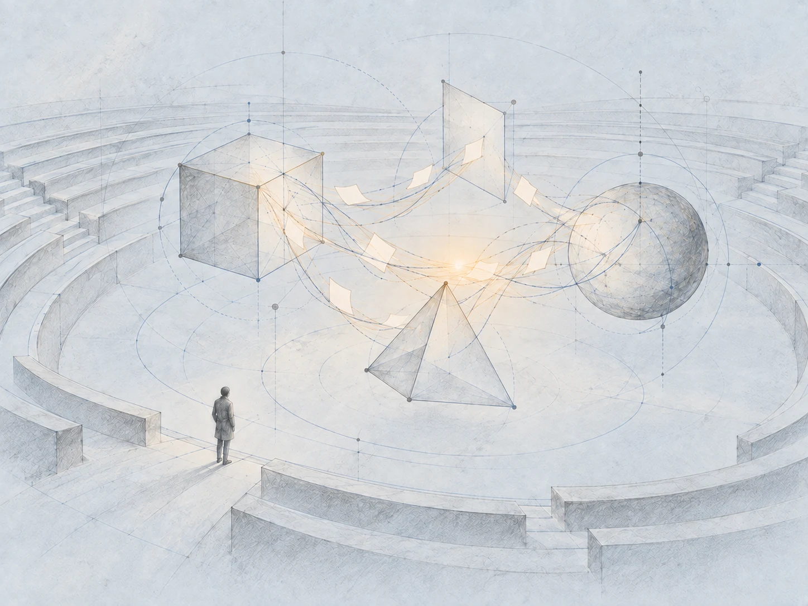

```text
Use case: illustration-story
Asset type: one standalone large editorial illustration for a narrative website, landscape 4:3.
Input images: the two attached images are STYLE REFERENCES ONLY. Match their pale paper, handmade graphite quality, thin cobalt technical lines and restrained warm light. Create an entirely NEW scene and composition; do not recreate the two circles, bridge of hands or branching landscape in the references.
Style/medium: sophisticated humanistic handmade graphite pencil and extremely thin ink linework on a very subtle pale blue-grey paper; fine cobalt blue construction lines, erased pencil traces, sensitive organic imperfections. Airy elegant editorial drawing, lightly technical and quietly hopeful. A delicate amber light accent; gentle graphite-grey shadows, no heavy dark outlines. A visual metaphor, not a literal diagram.
Composition: high-quality landscape 4:3, main subject well contained with breathing room, legible when displayed as a complete small image on mobile. No panel layout.
Hard constraints: Absolutely no text, words, letters, digits, numbers, equations, glyphs, pseudo-equations, labels, captions, signatures, logos or watermarks anywhere. Any papers and boards must be completely blank. No robots, chrome humanoids, science-fiction cliches, cartoon corporate illustration, caricatures, glossy 3D rendering, heavy shadows or saturated colors.
Primary request: a quiet abstract conference space, with empty amphitheatre rows curving into distance around several luminous open geometric forms which seem to exchange delicate threads of reasoning. Their exchanged proofs are only visual threads and small blank translucent paper planes, absolutely no symbols or writing. A single fine human silhouette pauses at the threshold, small in scale, observing the conversation.
Scene: wide oblique perspective of spare sketch-like amphitheatre seating with a few curved rows, not a photoreal hall. Floating geometric forms occupy the open center; the human remains at one lower outer edge. Keep the auditorium airy and light, with generous pale paper space and delicate blue perspective construction lines. A new composition; no landscape path, no table, no robot presenter.
Mood: wondrous, contemplative and gently estranged, mathematics continuing its own meeting while the human considers their place. Small amber light shared among the geometric forms, no dystopian menace or triumph.

Edycja
Use case: precise-object-edit
Input image: Image 1 is the EDIT TARGET, an existing graphite-and-cobalt abstract conference illustration.
Primary request: remove every faint text-like horizontal mark, scribble, line of writing and pseudo-equation from all of the small floating paper sheets. Each floating sheet must become entirely BLANK, containing only plain pale unmarked paper texture. No ruling lines, hatch-like interior marks, letters, digits, symbols or text may remain inside the paper sheets.
Constraints: change ONLY those marks on the paper sheets. Preserve the exact composition, amphitheatre, the single small human, all floating geometric forms, every connecting thread, technical construction line outside the sheets, pale blue-grey graphite paper style, amber light, aspect ratio and dimensions. Keep the edge contours and curved shapes of the small sheets. No added objects or text, no logo, no watermark.
```

## 07. Wciąż przychodzą na zajęcia

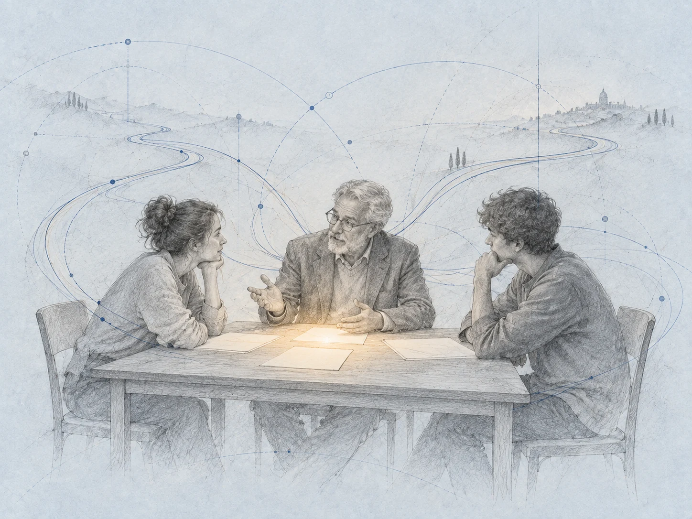

```text
Use case: illustration-story
Asset type: one standalone large editorial illustration for a narrative website, landscape 4:3.
Input images: the two attached images are STYLE REFERENCES ONLY. Match their pale paper, handmade graphite quality, thin cobalt technical lines and restrained warm light. Create an entirely NEW scene and composition; do not recreate the two circles, bridge of hands or branching landscape in the references.
Style/medium: sophisticated humanistic handmade graphite pencil and extremely thin ink linework on a very subtle pale blue-grey paper; fine cobalt blue construction lines, erased pencil traces, sensitive organic imperfections. Airy elegant editorial drawing, lightly technical and quietly hopeful. A delicate amber light accent; gentle graphite-grey shadows, no heavy dark outlines. A visual metaphor, not a literal diagram.
Composition: high-quality landscape 4:3, main subject well contained with breathing room, legible when displayed as a complete small image on mobile. No panel layout.
Hard constraints: Absolutely no text, words, letters, digits, numbers, equations, glyphs, pseudo-equations, labels, captions, signatures, logos or watermarks anywhere. Any papers and boards must be completely blank. No robots, chrome humanoids, science-fiction cliches, cartoon corporate illustration, caricatures, glossy 3D rendering, heavy shadows or saturated colors.
Primary request: an older professor and two young adult students having a thoughtful human conversation at a modest rectangular table with a few entirely blank paper sheets. A student leans forward with curiosity, the other listens, and the professor answers with a small gentle open-hand gesture. Human connection has value even when answers are easy to obtain.
Scene: medium-wide three-quarter view, the three complete human figures and the modest rectangular table remain the main subject. Around and beyond them, a few delicate independent blue pathways of knowledge separate and continue into pale paper space; lightly sketched construction arcs hover without touching faces. This must be distinct from a circular family gathering: rectangular table, only three adults, intimate university conversation, no sunlike table or child.
Mood: humane warmth, steady curiosity, quieter uncertainty about changing roles, genuine exchange rather than a formal lecture. Small restrained amber light rests on the blank papers, faces suggested with sensitive pencil gestures rather than portraits.
```

## 08. Generalnie się orientują

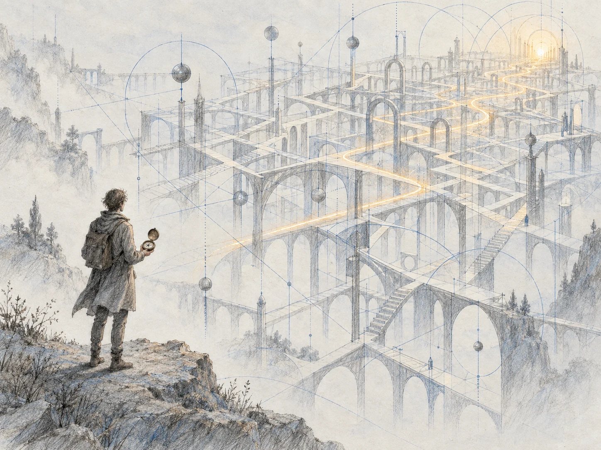

```text
Use case: illustration-story
Asset type: original chapter illustration for a Polish literary essay website, landscape 4:3.
Primary request: A generalist stands at the edge of a vast intricate open lattice labyrinth of knowledge, holding a simple unmarked compass. A thin amber path of light threads deep into the complex maze beyond the person's understanding.
Scene/backdrop: Pale paper ground, vast airy geometric labyrinth receding in depth; woven fine graphite lines and cobalt construction geometry.
Subject: One small quietly curious human figure holding a simple compass, and the enormous filigree maze. The maze is a porous structure of connected lines, arches and planes, not a solid walled maze.
Style/medium: Match the previously viewed STYLE references dialog.png and powrot.png in spirit only, with an entirely new scene. Restrained humanistic hand-drawn graphite pencil sketch, fine loose hatching, delicate cobalt blue geometric construction arcs and dotted lines, a very subtle pale blue-gray textured paper background, and gentle amber light. Abstract and technical yet warm, quiet, hopeful. Soft edges fade naturally into the paper. No polished digital or vector rendering.
Composition/framing: Landscape 4:3; contrast the human scale with the large labyrinth; generous breathing space, visible pencil texture.
Lighting/mood: Quiet uncertainty with a hopeful soft amber light path.
Constraints: Completely new composition, not a variation or reuse of the reference scenes. No text, letters, digits, fake equations, readable compass markings, logos, watermark, labels, robot faces, neon, or heavy darkness.
```

## 09. Sto dwadzieścia trzy strony

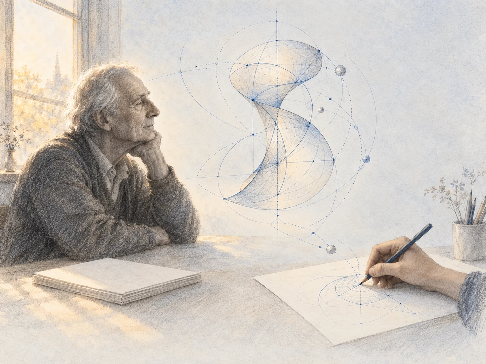

```text
Use case: illustration-story
Asset type: original chapter illustration for a Polish literary essay website, landscape 4:3.
Primary request: A retired mathematician sits quietly beside a softly lit window with a small closed stack of completely blank paper. A delicate geometric form rises from the work and flows into an image being sketched by a younger drawing hand.
Scene/backdrop: A spare room suggested by only a window frame, a simple desk and paper; the emerging geometric form occupies the airy central space.
Subject: The elderly person's calm profile near the window; blank papers; a suspended filigree geometric form; a younger hand with a pencil at another blank paper, transforming the form into art.
Style/medium: Match the previously viewed STYLE references dialog.png and powrot.png in spirit only, with an entirely new scene. Restrained humanistic hand-drawn graphite pencil sketch, fine loose hatching, delicate cobalt blue geometric construction arcs and dotted lines, a very subtle pale blue-gray textured paper background, and gentle amber light. Abstract and technical yet warm, quiet, hopeful. Soft edges fade naturally into the paper. No polished digital or vector rendering.
Composition/framing: Landscape 4:3; the retired figure is still, the emerging geometry and young hand imply a gentle continuation across the scene. Leave pale open margins.
Lighting/mood: Soft amber window light, peaceful, reflective and hopeful.
Constraints: Completely new composition, not a variation or reuse of the reference scenes. No text, letters, digits, fake equations, written notes, logos, watermark, labels, robot faces, neon, or heavy darkness. All papers are entirely unmarked except for pure geometric drawing by the young hand.
```

## 10. W dowodzie była Odyseja

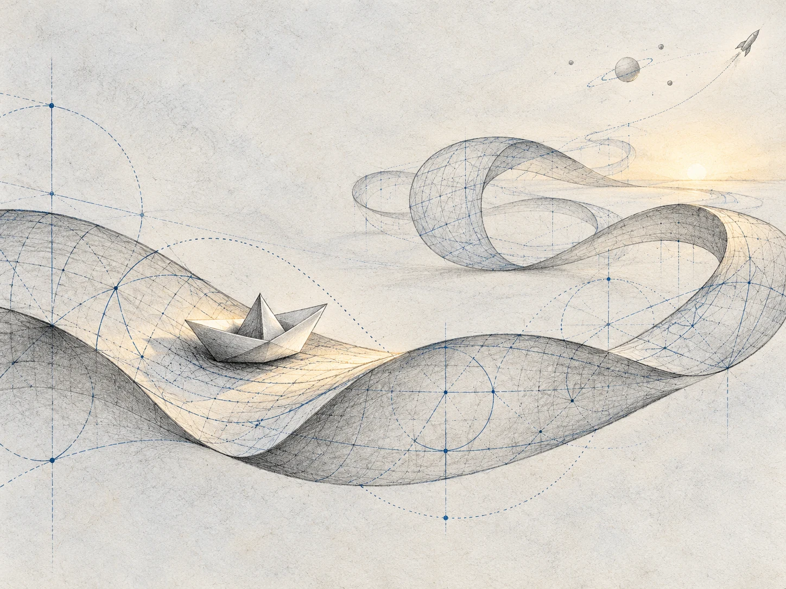

```text
Use case: illustration-story
Asset type: original chapter illustration for a Polish literary essay website, landscape 4:3.
Primary request: An abstract Odyssey: a small blank folded paper boat travels along a curled ribbon of geometric proof as though it were a sea. The ribbon flows in waves and loops made of fine graphite structure and cobalt construction lines. Far away a tiny filigree rocket and a delicate orbit suggest the wider journey.
Scene/backdrop: The sea is a ribbon of pure geometry on very pale textured paper, airy rather than realistic water. The boat occupies a small clear fold in the ribbon; rocket and orbital traces remain tiny in the distance.
Subject: One small folded paper boat, the broad curling geometric ribbon, a tiny faraway linework rocket with no markings.
Style/medium: Match the previously viewed STYLE references dialog.png and powrot.png in spirit only, with an entirely new scene. Restrained humanistic hand-drawn graphite pencil sketch, fine loose hatching, delicate cobalt blue geometric construction arcs and dotted lines, a very subtle pale blue-gray textured paper background, and gentle amber light. Abstract and technical yet warm, quiet, hopeful. Soft edges fade naturally into the paper. No polished digital or vector rendering.
Composition/framing: Landscape 4:3; sweeping organic geometric loops lead from the boat into the distance, ample pale paper space.
Lighting/mood: Gentle amber glint along part of the ribbon. Quiet tension and wonder, no disaster or threatening mood.
Constraints: Completely new composition, not a variation or reuse of the reference scenes. Geometry only: no text, letters, digits, fake equations, Greek symbols, logos, watermark, labels, smoke, explosion, catastrophe, robot faces, neon, or heavy darkness.
```

## 11. Kółeczko wciąż się kręci

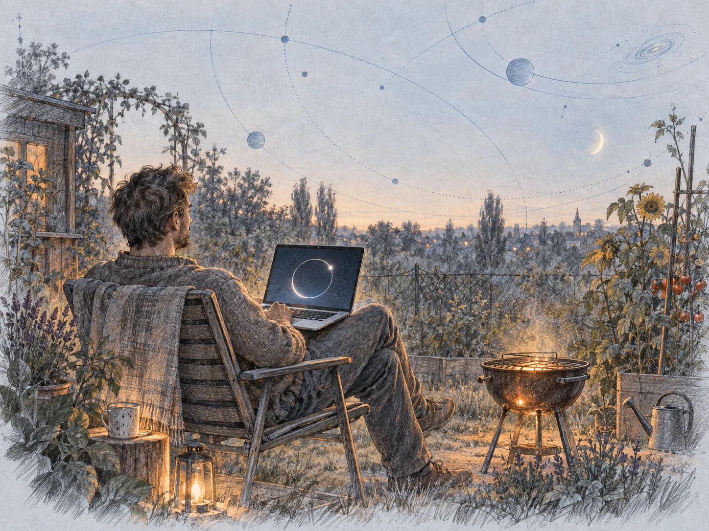

```text
Use case: illustration-story
Asset type: original chapter illustration for a Polish literary essay website, landscape 4:3.
Primary request: Darek sits in a simple garden chair at his allotment beside a small grill in the evening, with an open laptop. On its screen there is only a single empty luminous open orbit, a simple broken circular line suggesting waiting. Garden plants and a faint cosmic distance make the ordinary human curiosity feel connected to the universe.
Scene/backdrop: A quiet allotment garden sketched with a few plants and fine orbital arcs extending into the pale paper sky. The small grill gives a gentle amber warmth, not big flames.
Subject: One ordinary relaxed man in a chair, open laptop balanced naturally, small grill nearby, restrained plant details and distant abstract orbital geometry.
Style/medium: Match the previously viewed STYLE references dialog.png and powrot.png in spirit only, with an entirely new scene. Restrained humanistic hand-drawn graphite pencil sketch, fine loose hatching, delicate cobalt blue geometric construction arcs and dotted lines, a very subtle pale blue-gray textured paper background, and gentle amber light. Abstract and technical yet warm, quiet, hopeful. Soft edges fade naturally into the paper. No polished digital or vector rendering.
Composition/framing: Landscape 4:3; a warm intimate human foreground surrounded by generous pale space and the distant orbital curves.
Lighting/mood: Calm evening, warm human curiosity and hope, soft amber light against pale blue-gray paper rather than a dark night scene.
Constraints: Completely new composition, not a variation or reuse of the reference scenes. Laptop screen contains only one blank luminous open orbit and no interface or text. No letters, digits, fake equations, logos, watermark, labels, robot faces, neon, dramatic smoke, or heavy darkness.
```

## 12. Zachwycone liczbami pierwszymi

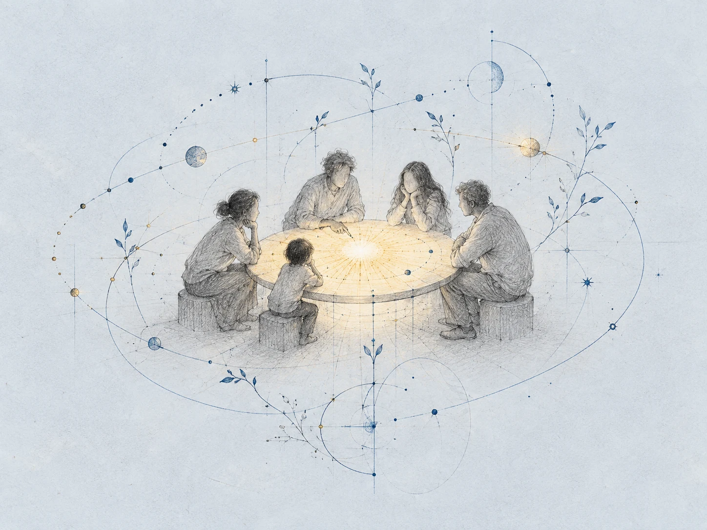

```text
Use case: illustration-story
Asset type: large narrative website illustration, one standalone image, landscape 4:3.
Primary request: an abstract sensitive sketch about curiosity returning. A tiny gathering of human figures at a circular sunlike table, including a figure at a child's scale, sharing a moment of open curiosity. Curved constellations made of simple dots and thin threads arc around them, and delicate technical construction lines begin to sprout like new growth. The circular table is both an everyday human place and a small warm sun, a metaphor for shared learning and possibility.
Scene/backdrop: very pale blue-grey paper, spacious and luminous, no literal interior or furniture scene beyond the simple circular gathering.
Style/medium: sophisticated graphite pencil and very thin ink linework, subtle cobalt blue technical construction lines, barely visible pencil erasure marks and handmade imperfections. Editorial drawing, restrained and sensitive, as one member of a visual series with unfinished geometry and warm sunlight.
Composition/framing: landscape 4:3; gathering small within a clear central metaphor, generous breathing room all around; complete main forms contained within central 75 percent so they remain meaningful on a mobile crop. Figures conveyed with a few tender graphite gestures, faces unspecified; curved orbits and new shoots remain light and airy.
Lighting/mood: restrained amber sunlight softly held in the circular table, contemplative warmth, shared wonder, humane scale, curiosity, quietly hopeful.
Color palette: very pale blue grey, graphite grey, thin cobalt lines, small warm amber accent.
Constraints: one coherent image, no panel layout. Purely visual metaphor; absolutely no typography, words, letters, digits, numbers, equations, labels, signatures, logos or watermarks anywhere. No literal childish cartoon, no caricatures, no stock corporate people illustration. No robots, no humanoid machines, no sci-fi cliché. No heavy black outlines, no glossy 3D rendering. High detail in the linework; keep the drawing gentle and uncluttered.
```

## Tło panelu Psyho i Bagińskiego

Jedna ilustracja o autorstwie i ludzkim wyborze: dwie dłonie wybierają ciepły, niedoskonały kadr spośród wielu szkicowanych możliwości. Wyraźny grafit, kobaltowe konstrukcje i bursztynowe światło. Obraz jest widoczny w całości, bez przygaszania: obok tekstu na komputerze i pod tytułem na telefonie.

Wygenerowano przez wbudowane image_gen, z dialog.webp jako referencją stylu. Plik strony: assets/psyho-choice-v2.webp; podgląd linku: assets/psyho-preview-v2.jpg (ten sam rysunek).

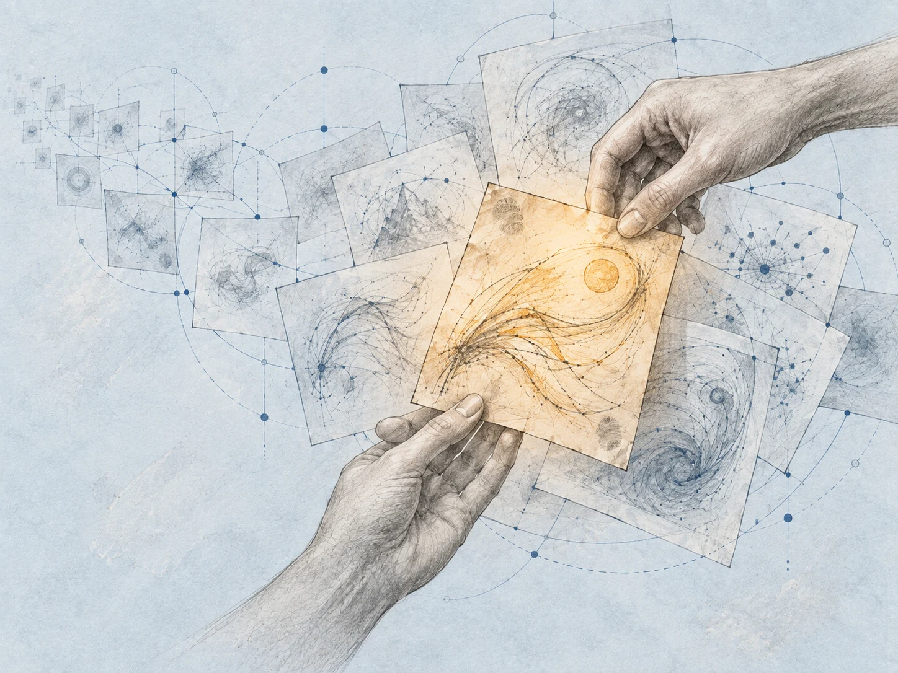

```text
Use case: illustration-story.
Asset type: one editorial landscape illustration for a Polish discussion page, aspect ratio 4:3.
Primary request: illustrate human authorship and thoughtful choice among a vast abundance of machine-generated possibilities. Make a NEW composition. Input image 1 is a STYLE REFERENCE ONLY, not an edit target.
Scene and subject: a large, anatomically natural human hand reaches into a fan of overlapping translucent paper frames, studies them, and carefully lifts one frame into the foreground. The chosen frame is visibly different: warm amber, a living irregular hand-drawn gesture, faint creases, graphite fingerprints and human imperfection. The other frames contain light, varied, unfinished abstract visual sketches and are linked by thin cobalt technical construction paths, nodes and branching lines. A subtle second human hand may support the selected frame from below, suggesting collaboration. The subject must be immediately readable and substantial, not merely decorative curves.
Style and medium: textured pale blue-grey sketchbook paper; confident graphite pencil and charcoal outlines, delicate crosshatching, thin technical blue drawing lines, a restrained amber light at the point of choice. Match the reference's tactile draftsmanship, human hands, technical geometry and hopeful quiet mood. Stronger visible contrast than a faded background: hands and foreground frames have clear dark graphite contour and readable shading at full opacity.
Composition: landscape 4:3, editorial and elegant. Main motif occupies the central and right two-thirds, fully visible without cropping. The left 30–35 percent is visually calmer for adjacent page typography, with sparse receding frames and traces, but the whole image remains a coherent illustration rather than an empty wash. The selected warm frame and the choosing fingertips form the unmistakable focal point. Complete composition must read beautifully on a phone.
Constraints: no text whatsoever, no letters, numbers, equations, labels, logos or watermark. No robots, literal computers, screens, futuristic glossy surfaces or photorealistic rendering. No huge blank background, no nearly invisible subject. Keep the image humane, intelligent and full of possibility.
```

## Tło wykładu Andrzeja Dragana

Jeden odrębny szkic: pofałdowana geometria łączy ciemne zagłębienie z jasnym otwarciem; mała postać nadaje scenie ludzką skalę. To metafora pytań i analogii z wykładu, nie diagram fizyczny ani ilustracja potwierdzonego istnienia białej dziury. Obraz pozostaje widoczny w całości na telefonie i komputerze.

Wygenerowano przez wbudowane image_gen, z rozgalezienie.webp jako referencją stylu. Plik strony: assets/dragan.webp; podgląd linku: assets/dragan-preview.jpg (ten sam rysunek).

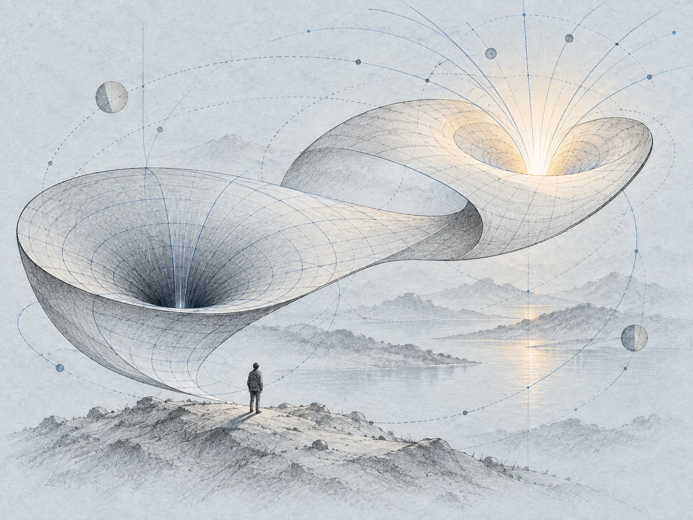

```text
Use case: illustration-story.
Asset type: one editorial hero illustration for a Polish essay about Andrzej Dragan's lecture "Dziury koloru białego"; responsive website, 4:3 landscape, full composition visible without cropping on mobile.
Input image 1: STYLE REFERENCE ONLY. Generate a new composition, do not edit or replicate the reference scene. Borrow its pale blue-gray sketchbook paper, graphite hatching, thin cobalt construction lines and restrained warm amber light.
Primary request: A single coherent, large, clearly visible hand-drawn landscape of curved geometry, metaphorically connecting scientific analogies one step at a time. A continuous broad folded ribbon of spacetime runs through the scene and contains two distinct openings: one concentrated dark inward depression, and one bright, open outward rising shape from which the cobalt lines gently spread outward. These are an editorial metaphor for black holes, white holes, contrasting direction and curiosity, not a scientific diagram of a proven object.
Subject and scale: The folded ribbon and its two openings dominate most of the frame and have confident graphite outlines, visible hatching and strong readable shapes. A small full-body human observer on the quiet lower shore studies the connections, providing human scale, not heroic grandeur.
Style/medium: elegant pencil and colored-pencil drawing on softly textured pale blue-gray paper; architectural sketchbook precision with human warmth, substantial graphite marks, delicate but visible cobalt arcs and construction lines. The main folds retain an expressive handcrafted imperfection. Small warm amber-white light at the outward opening; all other colors muted.
Composition/framing: one connected landscape, no panels; the whole central motif fits within the frame with comfortable margins, instantly readable at phone size. Both openings and the observer are fully visible. The picture carries its own story, so do not leave the majority of the frame blank.
Mood: thoughtful, hopeful, curious; quietly awe-inspiring without menace.
Constraints: absolutely no text, letters, numerals, equations, labels, arrows, logos or watermarks. No portrait likeness, hands close-up, robots, sci-fi machinery, glossy outer-space rendering, realistic black sphere, starfield wallpaper, photographic astrophysics, neon or empty faint curves. Do not copy the door frame, roads or trees from the reference.
```
